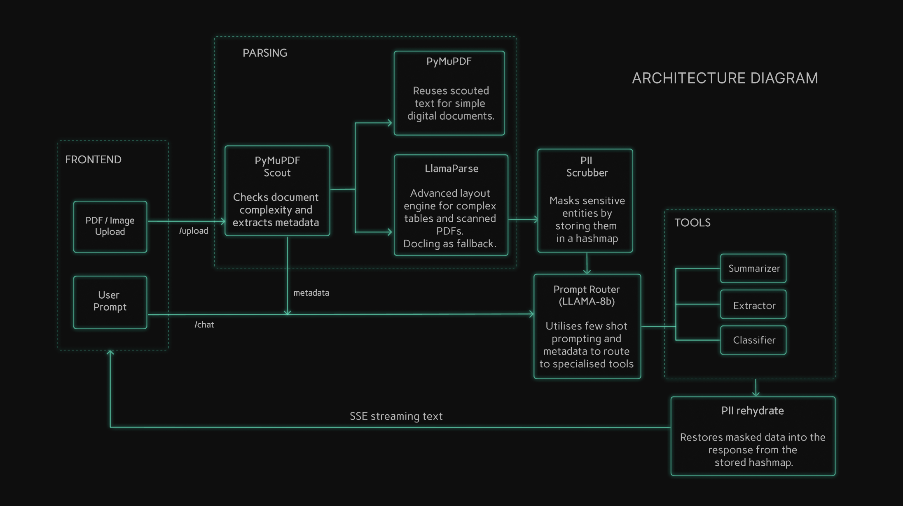

# Financial Document Intelligence Pipeline

## Table of Contents

- [1. Introduction](#1-introduction)
- [2. Demo Video](#2-demo-video)
- [3. Architecture](#3-architecture)
- [4. Design Decisions](#4-design-decisions)
- [5. Evaluation, Observability & Tests](#5-evaluation-observability--tests)
- [6. API Endpoints](#6-api-endpoints)
- [7. Tech Stack](#7-tech-stack)
- [8. Project Structure](#8-project-structure)
- [9. Setup](#9-setup)
- [10. Path to Production](#10-path-to-production)


## 1. Introduction

A full-stack **prompt routing** system that accepts user prompts alongside financial documents, **identifies the intent** from the prompt, and **routes the request to the appropriate processing module** — extraction, summarization, or classification — streaming results in real time.

Built with **React** and **FastAPI**, the core of the system is an **intent-aware router** powered by a Groq-hosted Llama 3.1-8B model with structured Pydantic output. The router analyzes each prompt against document metadata (page count, layout complexity, document type) to produce a routing decision with confidence scoring, before delegating to the matched specialized module.

The pipeline further includes automatic PII tokenization and rehydration, adaptive document parsing, and LangSmith-based observability.


## 2. Demo Video

[Demo video](https://github.com/user-attachments/assets/f269a39d-d271-4e1c-90c3-b0de458eb00a)


## 3. Architecture



**Pipeline Flow:**

1. **Upload & Scout** — Document is uploaded via `/upload`. PyMuPDF Scout performs a fast structural analysis (page count, drawing density, block statistics) to determine parsing complexity.

2. **Adaptive Parsing** — Based on Scout signals, the parser factory routes to either PyMuPDF (simple text PDFs) or LlamaParse REST API (complex layouts, tables, scanned documents). Docling is used as fallback/open source alternative to LlamaParse.

3. **PII Scrubbing** — Regex-based scrubber detects PAN, IFSC, and GSTIN patterns, replaces them with reversible tokens (`{{PAN_1}}`, `{{IFSC_2}}`), and stores the token map in the session.

4. **Prompt Routing (Core)** — The heart of the system. Each user prompt is analyzed alongside document metadata (page count, `doc_type_hint`, `likely_has_tables`) by a Groq-hosted **Llama 3.1-8B** model. The router uses few-shot examples and strict intent definitions to classify into `extraction`, `summarization`, or `classification`, returning a structured `RoutingDecision` (intent, confidence score, reasoning) validated via **Instructor + Pydantic**. This ensures every downstream module receives only the queries it is optimized for.

5. **Module Execution** — The matched module (Extractor, Summarizer, or Classifier) streams its response via SSE, with Cerebras as primary provider and Groq as automatic fallback.

6. **PII Rehydration** — Before tokens reach the user, the response is rehydrated — `{{PAN_1}}` is replaced back with the real value.


## 4. Design Decisions

### Prompt Routing Strategy

* **Intent Router as the Central Gatekeeper:** A lightweight 8B model classifies intent first, allowing downstream prompts to be specialized and high-quality.
* **Metadata-Augmented Routing:** Uses document signals (page count, table presence) to disambiguate intent in complex edge cases.
* **Structured Routing Output:** Enforces decisions through Pydantic/Instructor, ensuring valid schemas and eliminating fragile regex parsing.

### System Design

* **Multi-Provider LLM Fallback:** Automatically switches between Cerebras and Groq on 429 errors to prevent pipeline failures.
* **PII Tokenization over Redaction:** Uses reversible tokens to protect sensitive data while maintaining answer correctness.
* **Head-Tail Truncation with Snap:** Preserves critical document context using a 60/40 split and sentence-boundary snapping.
* **PyMuPDF Scout → Parser Routing:** Fast structural scans skip high-latency parsing APIs for simple digital PDFs, saving time and cost.


## 5. Evaluation, Observability & Tests

### Evaluation Suite

The project includes a custom evaluation framework (`backend/eval/`) that benchmarks routing separately and four live pipeline metrics across six diverse financial documents:

| Metric | What It Measures | Achieved |
|---|---|---|
| **Intent Routing Accuracy** | Correct classification of prompts into extraction/summarization/classification | **96.0%** |
| **PII Safety Score** | Lifecycle integrity, scrub recall, and token rehydration | **100.0%** |
| **Extraction Groundedness** | Faithfulness of extracted answers to the source document | **88.0%** |
| **Extraction Fidelity** | Exact and numeric value accuracy against ground truth | **84.0%** |
| **Pipeline Latency (Avg)** | Time-to-first-token (TTFT) perceived responsiveness | **1194 ms** |

For a detailed breakdown of methodology, intent-level metrics, and latency percentiles, see [Evaluation Details](./backend/eval/Evals.md).

### Observability

**LangSmith** is integrated across all four LLM modules (Router, Extractor, Summarizer, Classifier) using `@traceable` decorators. When enabled, every LLM call is logged to the LangSmith dashboard with:
- Full input prompts and raw outputs
- Token usage and latency waterfall
- Session-grouped traces for end-to-end request debugging

**Example:** View a [snapshot of system traces](./assets/Langsmith.png) showing the router delegating to specialized modules.

### Tests

The backend includes a formal test suite covering core utility operations and API endpoints, maintaining a strict boundary from the LLM observability evaluation routines. Please see [Tests.md](./backend/tests/Tests.md) for detailed analysis and execution results.


## 6. API Endpoints

| Method | Endpoint | Description |
|---|---|---|
| `GET` | `/health` | Health check. Returns `{"status": "ok"}`. |
| `POST` | `/upload` | Accepts a PDF or image file. Returns `session_id` with status `processing` (202). Phase A runs asynchronously. |
| `GET` | `/status/{session_id}` | Poll for document processing status. Returns `processing`, `ready`, or `failed` with metadata. |
| `POST` | `/session` | Creates a text-only session (no document). Returns an immediately-ready `session_id`. |
| `POST` | `/chat` | Main query endpoint. Accepts `{session_id, prompt}`. Returns an SSE stream of token events and a terminal `done` event with routing metadata. |


## 7. Tech Stack

* **Frontend:** React 19, Vite, Vanilla CSS, React-Markdown, Remark-GFM
* **Backend:** Python 3.9+, FastAPI, Uvicorn
* **LLMs:**
    * Intent Routing: Groq (Llama 3.1-8B via `instructor`)
    * Extraction & Summarization: Cerebras (Qwen 3-235B) with Groq (Llama 3.3-70B) fallback
    * Classification: Groq (Llama 3.3-70B) with Cerebras fallback
* **Document Parsing:** PyMuPDF (structural scout + simple extraction), LlamaParse (complex layouts & tables) with Docling as fallback
* **PII:** Regex-based scrubber for PAN, IFSC, GSTIN with reversible tokenization
* **Structured Output:** Pydantic + Instructor
* **Observability:** LangSmith (`@traceable` decorators)
* **Evaluation:** Custom async evaluation runner with ground-truth fixture files


## 8. Project Structure
```
Prompt-routing/
├── frontend/                        # React Frontend (Vite)
│   ├── src/
│   │   ├── views/                   # LandingView, ResultsView
│   │   ├── components/              # UploadArea, MessageBubble, FilePreview
│   │   ├── hooks/                   # usePolling, useSSEStream
│   │   └── App.jsx
│   └── package.json
├── backend/                         # FastAPI Backend
│   ├── modules/                     # LLM Modules
│   │   ├── router.py                # Intent classification (Groq 8B)
│   │   ├── extractor.py             # Data extraction (Cerebras → Groq fallback)
│   │   ├── summarizer.py            # Document summarization (Cerebras → Groq)
│   │   └── classifier.py            # Document type classification (Groq → Cerebras)
│   ├── utils/                       # Core Utilities
│   │   ├── scout.py                 # PyMuPDF structural pre-scan
│   │   ├── parser_factory.py        # Adaptive parser routing
│   │   ├── pii.py                   # PII scrubbing & rehydration
│   │   ├── truncation.py            # Context window management
│   │   └── metadata.py              # Metadata assembly
│   ├── schemas/                     # Pydantic response schemas
│   ├── eval/                        # Evaluation Suite
│   │   ├── fixtures/                # Ground truth JSON
│   │   ├── metrics/                 # Routing, PII, groundedness, fidelity, latency metrics
│   │   ├── run_eval.py              # Live eval runner for PII, fidelity, groundedness, latency
│   │   └── api_client.py            # SSE client for eval
│   ├── main.py                      # FastAPI app & route definitions
│   ├── pipeline.py                  # Background upload processing pipeline
│   ├── session.py                   # In-memory session store
│   └── config.py                    # All thresholds, models, and env loading
├── parser_tests/                    # Parser comparison outputs
├── docker-compose.yml               # Docker orchestration
└── .env                             # API keys (not committed)
```


## 9. Setup

### Quick Start (Docker)

1.  **Prerequisites**: Install [Docker Desktop](https://www.docker.com/products/docker-desktop/).
2.  **Config**: Create a `.env` file in the `backend/` directory (see [Step 2](#step-2-backend-setup) below).
3.  **Launch**:
    ```bash
    docker-compose up --build
    ```
4.  **Access**: Frontend at `http://localhost:5173`, Backend at `http://localhost:8000`.

---

### Manual Setup

### Prerequisites
* Python 3.9+
* Node.js 18+
* API keys: `GROQ_API_KEY`, `LLAMA_CLOUD_API_KEY`, `CEREBRAS_API_KEY`
* (Optional) `LANGCHAIN_API_KEY` for LangSmith observability

### Step 1: Clone & Setup
```bash
git clone <your-repo-link>
cd Prompt-routing
```

### Step 2: Backend Setup
```bash
cd backend
python3 -m venv venv
source venv/bin/activate

pip install -r requirements.txt
```

Create a `.env` file in `/backend` (Get keys at [Groq](https://console.groq.com/), [LlamaCloud](https://cloud.llamaindex.ai/), [Cerebras](https://cloud.cerebras.ai/), and [LangSmith](https://smith.langchain.com/)):
```env
GROQ_API_KEY=your_groq_key
LLAMA_CLOUD_API_KEY=your_llamaparse_key
CEREBRAS_API_KEY=your_cerebras_key

# Optional: LangSmith observability
LANGCHAIN_TRACING_V2=true
LANGCHAIN_API_KEY=your_langsmith_key
LANGCHAIN_PROJECT=fdip_pipeline
```

### Step 3: Frontend Setup
```bash
cd frontend
npm install
```

### Step 4: Run the Application

**Terminal 1: Backend**
```bash
cd backend
source venv/bin/activate
export PYTHONPATH="."
uvicorn main:app --host 0.0.0.0 --port 8000
```

**Terminal 2: Frontend**
```bash
cd frontend
npm run dev
```

Access the application at `http://localhost:5173`.


## 10. Path to Production

* **Parsing:** Replace LlamaParse with a **VLM-based agentic parser** (e.g., **Reducto** or **NVIDIA Nemotron-Parse**) that uses multi-pass layout segmentation and contextual correction — critical for messy, unstructured banking documents where standard OCR consistently fails on nested tables and multi-column layouts.

* **PII Scrubbing:** Migrate from regex patterns to a **dedicated NLP scrubber** (e.g., **Microsoft Presidio** or **spaCy NER pipelines**) to capture a broader range of PII entities — names, addresses, account numbers — with higher recall than hand-tuned regular expressions.

* **Summarization:** Upgrade from single-pass context stuffing to a **MapReduce summarization** strategy, where each document chunk is summarized independently (map) and then merged into a final summary (reduce) — eliminating context window limitations on large documents.

* **Extraction:** Move to a **RAG-based extraction** approach with chunked vector retrieval, so the extractor can locate and pull specific values from any section of a 100+ page document without relying on truncation heuristics.

* **Observability & Reliability:** Add **Prometheus + Grafana** dashboards for real-time latency, token usage, and error-rate monitoring. Replace the in-memory session store with **Redis** for horizontal scalability and crash recovery.
